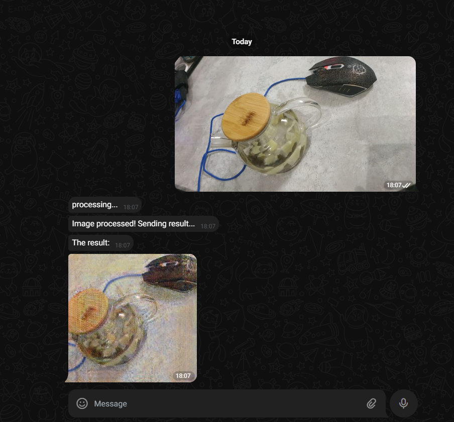

## Monet style telegram bot

Based on CycleGAN architecture [Source](https://arxiv.org/abs/1703.10593)


### Steps
1. Ensure that the GPU driver is installed properly on the instance: [CUDA installation guide.](https://docs.nvidia.com/cuda/cuda-installation-guide-linux/index.html)
2. Create .env file according to [example.env](example.env)
3. Use docker-compose to build the backend.
```
docker-compose --profile prod up
```

#### Training
In order to train the model
```
docker-compose --profile dev up
```
connect to container (or use .devcontainer in vscode), and see [notebooks](./notebooks/) with examples.


To display training graphs, the Visdom server was configured, which will be available at http://localhost:8097.